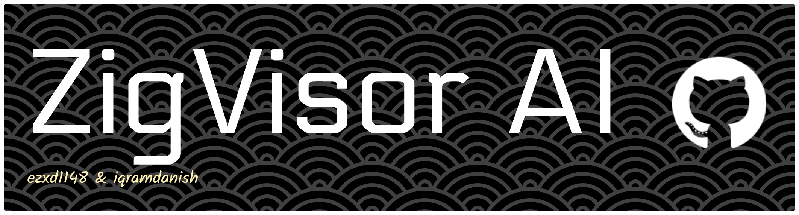

<h1 align="center">ZigVisor AI</h1>




<div align="center">
<h1 align="center" style="color: blue, font-size: 28px, margin: 10px 0;">A Fine-tuned AI model that specializes in Zig Programming Language</h1>
<p align="center" style="font-size: 18px; margin: 10px 0;">Model is fine tuned using AMD Instict MI300X as part of AMD Developer Hackathon.</p>
<p align="center" style="font-size: 10px; margin: 10px 0;">By ezxd1148 and iqramdanish</p>
</div>

## What is it?

ZigVisor AI is an AI model that is fine-tuned using *AMD Instict MI300X* as part of AMD Developer Hackathon. The name itself is just Zig Advisor combined. It is fine-tuned using LoRA (Low-Rank Adaptation) (Dont forget to change) on top of the base model which is small Qwen(Dont forget to change).

## How does it work?

We used raw data from Hugging Face which is called "the stack v1" by bigcode (a collection of open-source datasets) to fine-tune the model. The raw data is then processed and cleaned through a series of filtering and formatting steps before being fed into generative AI models (in this case we used Hy3-preview from openrouter) to generate instruction. The instruction is then used to fine-tune the model using LoRA. We were lucky to be handed an opportunity to use *AMD Instict MI300X* as part of AMD Developer Hackathon. It was a great opportunity to learn and work with cutting-edge hardware and AI technologies.

We used nanana as our frontend and python FastAPI as our backend. This enables seamless communication between the frontend and backend, allowing users to interact with the model through a user-friendly interface.

## How to use it?

To use the model, can run the dashboard locally or use the API endpoint.

```bash
coming soon
```

> part ni nak bagi tutor run ml kita er -untuk iwram

## Expectation for the Hackathon

We actually don't expect much from our solution to track 2. We just wanted to see if we could build a simple AI model that we can proudly say we built.

## Contributing

Contributions are welcome! Please open an issue or submit a pull request on the [GitHub repository](https://github.com/ezxd1148/zig-model).

Since this is our first AI project, we welcome any feedback or suggestions from the community.

## License

The model is licensed under the [MIT License](https://opensource.org/licenses/MIT).
